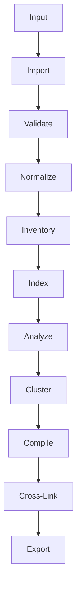

# Oracle Knowledge Compiler (OKC) - Architecture Document

## Mission

The Oracle Knowledge Compiler (OKC) is an AI-agnostic knowledge compilation platform designed to import conversations, documents, and data from multiple AI systems and seamlessly convert them into a universal internal knowledge model.

## Objectives

- **Preserve knowledge:** Safeguard insights, facts, and discussions from ephemeral formats or isolated silos.
- **Eliminate duplication:** Identify and consolidate redundant information across different inputs.
- **Organize by concepts instead of conversations:** Shift from a chronological or conversational view to a topic-driven, conceptual knowledge graph.
- **Build a reusable second brain:** Create a centralized, highly searchable repository of accumulated knowledge.
- **Export to multiple knowledge platforms:** Provide flexibility by allowing the compiled knowledge to be exported to various tools, formats, and databases.

## High-Level Architecture

The OKC processing pipeline is designed as a linear sequence of modular stages, moving data from raw input to a refined, cross-linked knowledge base.

### Pipeline Stages

1. **Input:** The raw data source, which can be API endpoints, local files (JSON, CSV, PDF, Markdown), or direct user inputs.
2. **Import:** Source-specific plugins read the input and parse the raw format.
3. **Validate:** The imported data is checked for integrity, completeness, and adherence to expected schemas.
4. **Normalize:** Validated data is mapped into OKC's universal internal data model.
5. **Inventory:** The normalized data is logged into a central registry to track provenance and metadata.
6. **Index:** Text and metadata are indexed to enable rapid searching and retrieval during later stages.
7. **Analyze:** NLP and AI techniques are applied to extract entities, sentiment, intent, and key concepts from the data.
8. **Cluster:** Analyzed items are grouped together based on semantic similarity and shared concepts.
9. **Compile:** Clustered data is synthesized and summarized into coherent, conceptual knowledge nodes.
10. **Cross-Link:** Relationships and references between different knowledge nodes are discovered and explicitly linked.
11. **Export:** The final knowledge graph is translated and pushed to external knowledge management platforms or serialized into standard formats.

## Design Principles

- **Modular:** The system is composed of decoupled components, allowing individual parts to be upgraded or replaced without affecting the whole.
- **Plugin-based:** Importers and exporters are implemented as plugins, making it easy to support new platforms and data formats.
- **AI-agnostic:** The core pipeline does not rely on a single AI provider. Different models can be swapped in for the analysis and compilation stages.
- **Deterministic before AI:** The initial stages (Import, Validate, Normalize, Inventory, Index) rely on strict, deterministic logic to ensure data fidelity before applying probabilistic AI models.
- **Scalable:** The architecture is designed to handle large volumes of conversations and documents efficiently.
- **Extensible:** New stages, data types, and capabilities can be added to the pipeline as the system evolves.
- **Testable:** Every stage and module can be independently verified with automated unit and integration tests.

## Internal Data Model

A core architectural decision in OKC is that **every importer converts data into the same `Conversation` and `Message` objects**. 

By standardizing the internal representation, the system decouples the source format from the processing logic. This means that the downstream pipeline (Validate → Export) only needs to understand a single data structure, drastically reducing complexity. Whether the original data came from a ChatGPT export, a raw Markdown file, or a voice transcript, it is uniformly processed as a series of messages within a conversation context.

## Future Vision

OKC aspires to be a universal knowledge compiler. It will expand beyond initial integrations to import data from an extensive array of sources, including:
- **AI Systems:** ChatGPT, Gemini, Claude, Grok, Copilot, Perplexity.
- **Static Formats:** PDFs, Markdown, HTML, text documents.
- **Communication Channels:** Emails, voice transcripts, chat logs.
- **Future AI Systems:** Any upcoming platforms or mediums that generate valuable insights.

Ultimately, OKC will act as the universal bridge between fragmented information streams and structured, enduring knowledge bases.
